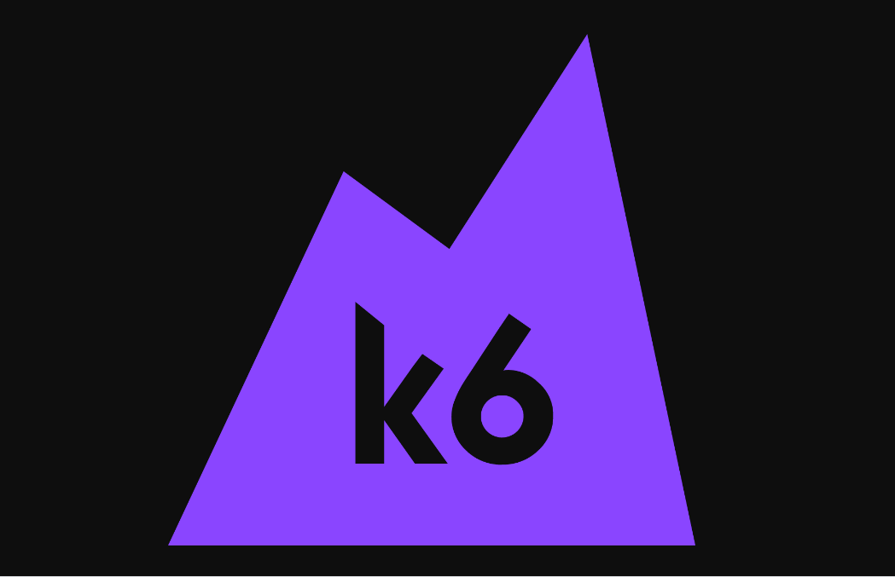
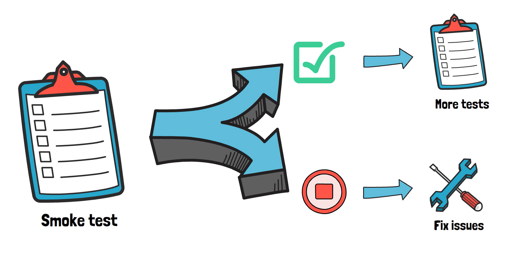
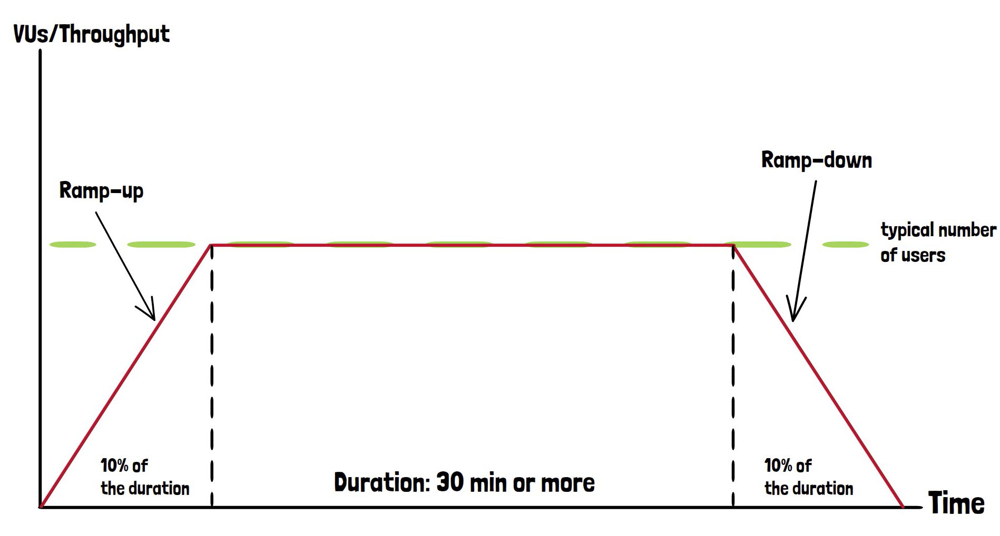
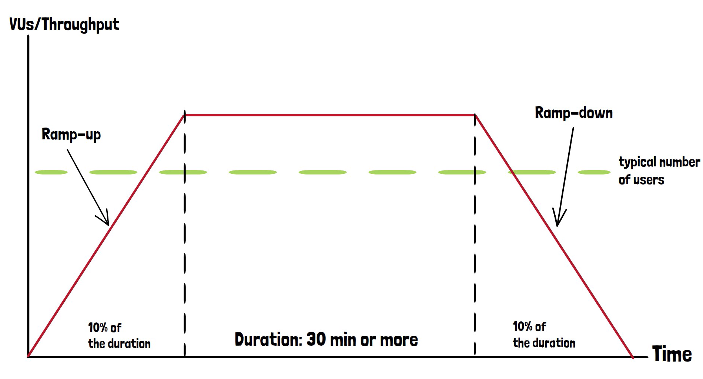
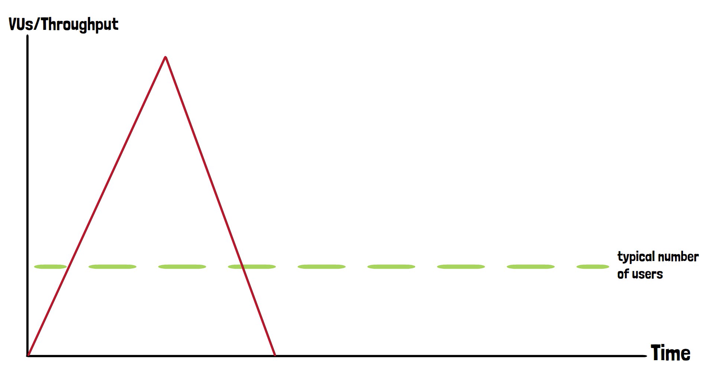
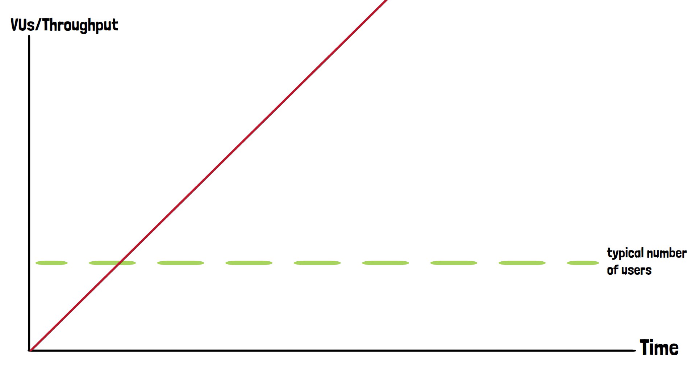
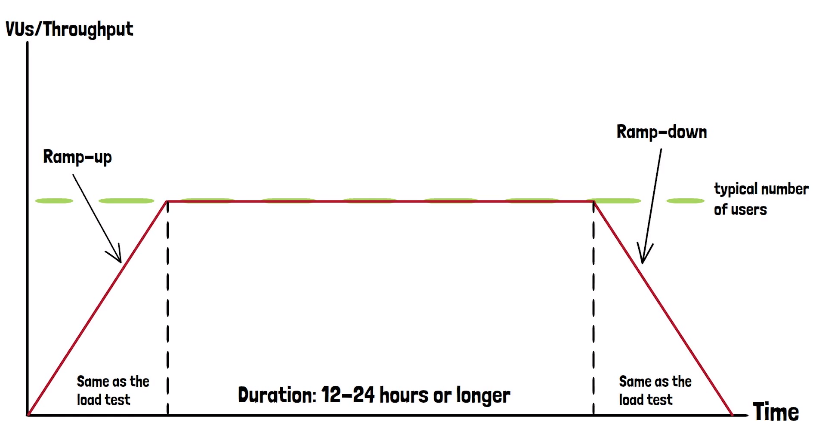

<p align="center">
  <a href="" rel="noopener">
 </a>
</p>

<h2 align="center">FORMACIÓN K6 TESTING</h3>

<div align="center">

[]()
[](https://github.com/kylelobo/The-Documentation-Compendium/issues)
[](https://github.com/kylelobo/The-Documentation-Compendium/pulls)
[](/LICENSE)

</div>

---

<p align="center"> En esta formación se explica los tipos de testing que se pueden hacer atraves de K6, así como su comprensión y entendimiento. Además de diferentes usos que le podemos dar.
    <br> 
</p>

## 📝 Índice

- [¿Que es K6?](#about)
- [Instalación](#instalation)
- [Lanzamiento de los tests](#runTests)
- [Tipos de test](#tests)
- [Built Using](#built_using)
- [Autor](#author)
- [Agradecimientos](#acknowledgement)

## 🔎 ¿Que es K6? <a name = "about"></a>

Grafana k6 es una herramienta de prueba de carga de código abierto que hace que las pruebas de rendimiento sean fáciles y productivas para los equipos de ingeniería. k6 es gratuito, centrado en el desarrollador y extensible.

Con k6, puede probar la confiabilidad y el rendimiento de sus sistemas y detectar regresiones y problemas de rendimiento con anticipación. k6 le ayudará a crear aplicaciones resistentes y de alto rendimiento que escalan.

k6 ha sido desarrollado por [Grafana Labs](https://grafana.com/) y la comunidad.

## 💻 Instalación <a name = "instalation"></a>

### Linux
```bash
sudo gpg -k
sudo gpg --no-default-keyring --keyring /usr/share/keyrings/k6-archive-keyring.gpg --keyserver hkp://keyserver.ubuntu.com:80 --recv-keys C5AD17C747E3415A3642D57D77C6C491D6AC1D69
echo "deb [signed-by=/usr/share/keyrings/k6-archive-keyring.gpg] https://dl.k6.io/deb stable main" | sudo tee /etc/apt/sources.list.d/k6.list
sudo apt-get update
sudo apt-get install k6
```

### Mac
Usando [Homebriew](https://brew.sh/):

```bash
brew install k6
```

### Windows

Si utiliza [Chocolatey](https://chocolatey.org/) puedes instalar el paquete k6 no oficial con:
```shell
choco install k6
```

Si utiliza el [Administrador de paquetes de Windows](https://github.com/microsoft/winget-cli), instale los paquetes oficiales desde los manifiestos de k6:
```shell
winget install k6 --source winget
```
Alternativamente, puede descargar y ejecutar el [instalador oficial más reciente](https://dl.k6.io/msi/k6-latest-amd64.msi).

### Docker

```bash
docker pull grafana/k6
```
Imagen separada que puede usar con "chromium" instalado para ejecutar pruebas del navegador k6.
```bash
docker pull grafana/k6:master-with-browser
```

## ▶️ Lanzamiento de los tests <a name = "runTests"></a>

Para una ejecución rápida del test deberemos realizar este comando:

```shell
k6 run test.js
```
En el caso de querer para la ejecición simplemente presione `ctrl + c`

## ✅ Tipos de test <a name="tests"></a>

### [Smoke testing](Types_of_tests/smoke_test.js)

<p align="justify">Las pruebas de humo, también conocidas como pruebas de sanidad o <i>"smoke tests"</i>, son un tipo de prueba de software diseñado para verificar rápidamente si las funciones básicas de una aplicación funcionan correctamente. En el contexto de k6, una herramienta de prueba de carga y rendimiento, las pruebas de humo pueden proporcionar una validación inicial de que la aplicación está en un estado operativo mínimo antes de realizar pruebas más exhaustivas de rendimiento.

<p align="center">
  </a>
</p>

Para este tipo de pruebas vamos a utilizar 1 VU o <i>"Virtual User"</i> durante un tiempo no muy prolongado, ya que queremos simular un usuario real utilizando dicha aplicación.
Estos valores los configuraremos en la constante de opciones: </p>

```js
export const options = {
    vus : 1,
    duration: '30s'
}
```

### Propósito de los smoke test:
**1. Verificación de Funcionalidad Esencial:**
Las pruebas de humo se centran en asegurar que las funciones críticas y esenciales de la aplicación estén operativas. Esto ayuda a identificar problemas fundamentales antes de realizar pruebas más extensas.

**2. Retroalimentación Rápida:**
Al ser pruebas rápidas y sencillas, las pruebas de humo proporcionan una retroalimentación rápida sobre la salud general de la aplicación, permitiendo a los equipos de desarrollo abordar problemas de manera temprana.

**3. Integración Continua:**
Son ideales para la integración continua, ya que pueden ejecutarse automáticamente cada vez que se realiza una implementación o actualización en el código fuente.

***

### [Load testing](Types_of_tests/load_test.js)

<p align="justify">Las pruebas de carga, son un conjunto de pruebas que está diseñado para evaluar el rendimiento y la capacidad de carga de una aplicación bajo condiciones de uso intensivo. Las pruebas de carga permiten identificar cuellos de botella, evaluar el tiempo de respuesta y verificar la capacidad de escalabilidad de la aplicación.

<p align="center">
  </a>
</p>

Para este tipo de pruebas vamos a dividir la prueba en fases <i>("stages")</i>. La primera fase es la fase de subida incrementar de usuarios accediendo a la aplicación hasta un límite de la aplicación estimado anteriormente, pero sin sobrepasarlo y ocupando más o menos un 10% del tiempo de la segunda. La segunda fase es una fase más larga donde se estima que puede durar 30 minutos o más, manteniendo la cantidad de usuarios virtuales (en este caso <i>"target"</i>) estáticos. Para la tercera y última fase bajeremos progresivamente los usuarios hasta ser 0 ocupando también un 10% de la prueba. 
> (Ver imagen para más información)

### Propósito de los load test:
**1. Evaluar la Escalabilidad:** Determinar cómo escala la aplicación en términos de rendimiento a medida que aumenta la carga. Esto ayuda a identificar cuellos de botella y limitaciones en la capacidad de la aplicación.

**2. Verificar el Rendimiento bajo Carga:** Evaluar el rendimiento general de la aplicación bajo condiciones de uso intensivo. Esto incluye la medición de tiempos de respuesta, latencia y otros indicadores clave de rendimiento.

**3. Identificar Cuellos de Botella:** Descubrir componentes, funciones o áreas específicas de la aplicación que pueden volverse ineficientes o experimentar problemas de rendimiento cuando se enfrentan a cargas significativas.

**4. Garantizar Estabilidad:** Asegurarse de que la aplicación puede manejar la carga máxima sin fallar, bloquearse o experimentar errores críticos. Esto es crucial para mantener la disponibilidad y la confiabilidad del servicio.

**5. Optimizar Recursos:** Identificar oportunidades de optimización en términos de recursos del sistema, como el uso de CPU, memoria y ancho de banda de red, para garantizar un uso eficiente durante períodos de carga intensiva.

**6. Prepararse para Picos de Tráfico:** Anticipar y prepararse para momentos de alta demanda, como eventos promocionales, lanzamientos de productos o cualquier situación en la que se espera un aumento significativo en el tráfico.

**7. Cumplir con Requisitos de SLA (Acuerdo de Nivel de Servicio):** Validar que la aplicación cumple con los acuerdos de nivel de servicio establecidos, especialmente en lo que respecta a los tiempos de respuesta y la disponibilidad.

**8. Detectar Problemas de Rendimiento Graduales:** Identificar problemas de rendimiento que puedan surgir gradualmente con el tiempo, especialmente en sistemas que experimentan un crecimiento constante de usuarios.

**9. Evaluar el Comportamiento a Largo Plazo:** Analizar cómo se comporta la aplicación durante períodos prolongados de carga para comprender su estabilidad y rendimiento a largo plazo.

**10. Realizar Validaciones de Implementación:** Integrar pruebas de carga en procesos de integración continua para validar el rendimiento después de cada implementación y garantizar que no se introduzcan degradaciones no deseadas.

### [Stress testing](Types_of_tests/stress_test.js)

<p align="justify">Las pruebas de estrés se centran en evaluar cómo se comporta una aplicación cuando se somete a niveles extremos de carga o a condiciones que superan los límites de capacidad normales. El objetivo principal es identificar el punto de quiebre y comprender cómo la aplicación se recupera después de situaciones de estrés extremo.<br>
Un claro ejemplo es una aplicación de compra online donde se acerca el black friday y el número de usuario aumenta significativamente esos días, por lo tanto la aplicación tiene que estar preparada para esa cantidad de usuarios en un plazo corto de tiempo.

<p align="center">
  </a>
</p>

Como se puede observar, las pruebas de estrés tienen la misma lógica de las pruebas de carga, con la diferencia de la cantidad de usuarios que acceden a la página en ese tiempo, buscando así el punto de quiebre de la aplicación.
> (Ver imagen para más información)

### Propósito de los stress test:
**1. Identificar el Punto de Quiebre:** Determinar el nivel máximo de carga que la aplicación puede manejar antes de experimentar fallas, degradación del rendimiento o errores críticos.

**2. Evaluar la Estabilidad en Condiciones Extremas:** Probar la capacidad de la aplicación para mantener la estabilidad y el rendimiento bajo condiciones extremas, como picos de tráfico repentinos o altas cargas sostenidas.

**3. Validar Mecanismos de Recuperación:** Comprobar la eficacia de los mecanismos de recuperación de la aplicación después de periodos de estrés extremo. Esto incluye la capacidad de la aplicación para recuperarse y volver a un estado operativo normal.

**4. Identificar Cuellos de Botella Ocultos:** Descubrir componentes, servicios o funciones específicas que pueden volverse ineficientes o experimentar problemas de rendimiento solo cuando la carga alcanza niveles extremos.

**5. Evaluar la Resiliencia de la Arquitectura:** Comprobar la capacidad de la arquitectura de la aplicación para resistir presiones extremas sin comprometer la disponibilidad o la integridad de los datos.

**6. Anticipar Situaciones Críticas:** Identificar posibles escenarios críticos que podrían afectar el rendimiento de la aplicación en situaciones del mundo real, como eventos de marketing, lanzamientos de productos o emergencias.

**7. Cumplir con Estándares de Rendimiento:** Validar que la aplicación cumple con los estándares de rendimiento establecidos en términos de tiempos de respuesta, latencia y otros indicadores clave, incluso bajo condiciones extremas.

**8. Optimizar Recursos de Infraestructura:** Identificar oportunidades de optimización en términos de recursos del sistema, como CPU, memoria y ancho de banda, durante condiciones de carga máxima.

**9. Mejorar la Planificación de Capacidad:** Proporcionar datos valiosos para la planificación de capacidad futura, permitiendo a los equipos ajustar la infraestructura para manejar aumentos proyectados en la carga de trabajo.

**10. Evaluar el Comportamiento a Largo Plazo:** Analizar cómo se comporta la aplicación durante períodos prolongados de estrés para comprender su resistencia y rendimiento a largo plazo.

### [Spike testing](Types_of_tests/spike_test.js)

<p align="justify">Las pruebas de incremento están diseñadas para evaluar cómo responde la aplicación cuando experimenta un aumento brusco y significativo en la carga o tráfico. El objetivo principal es medir la capacidad de la aplicación para gestionar ráfagas repentinas de usuarios y evaluar su comportamiento bajo condiciones de estrés temporal.

<p align="center">
  </a>
</p>

Estás pruebas tienen un objetivo conciso, evaluar la capacidad de la aplicación para manejar un aumento del 200% en la carga de usuarios en menos de 5 minutos.
> (Ver imagen para más información)

### Propósito de los spike test:
**1. Evaluar la Capacidad de Escalabilidad Vertical:** Verifica la capacidad de la aplicación para manejar incrementos repentinos en la carga de usuarios, especialmente cuando se produce un aumento significativo en un corto período de tiempo, simulando ráfagas repentinas de tráfico para evaluar cómo la aplicación escala verticalmente, es decir, si puede asignar eficientemente más recursos para manejar la carga adicional.

**2. Validar la Respuesta en Situaciones Críticas:** Comprueba cómo responde la aplicación en situaciones críticas donde la demanda de usuarios aumenta de manera significativa, como durante eventos especiales o promociones. Logrado mediante la creación de escenarios de prueba que simulan ráfagas de tráfico repentinas, se evalúa la capacidad de la aplicación para mantener la estabilidad y el rendimiento bajo condiciones de estrés temporal.

**3. Identificar Problemas de Degradación Persistente:** Detecta posibles problemas de rendimiento que podrían persistir después del periodo de incremento repentino, indicando debilidades en la capacidad de la aplicación para recuperarse completamente. Esto se consigue analizando el rendimiento y la estabilidad de la aplicación después de la prueba de incremento repentino, se busca identificar cualquier degradación persistente en el rendimiento que pueda requerir atención y optimización.

### [Breakpoint testing](Types_of_tests/breakpoint_test.js)

<p align="justify">Las pruebas de ruptura están diseñadas para evaluar el comportamiento de la aplicación cuando se somete a cargas extremas que superan su capacidad máxima. Este tipo de prueba tiene como objetivo identificar el punto de quiebre o el límite absoluto de la aplicación, proporcionando información valiosa sobre su estabilidad y resistencia bajo condiciones extremas y durante un tiempo prolongado.

<p align="center">
  </a>
</p>

> (Ver imagen para más información)

### [Soak testing](Types_of_tests/soak_test.js)

<p align="justify">Las pruebas de duración prolongada están diseñadas para evaluar la estabilidad y el rendimiento sostenido de una aplicación bajo carga constante y prolongada. Estas pruebas buscan identificar posibles problemas de fuga de recursos, memoria o cualquier degradación gradual del rendimiento que pueda surgir después de un periodo extendido de actividad.

<p align="center">
  </a>
</p>

> (Ver imagen para más información)

## 🚀 Deployment <a name = "deployment"></a>

Add additional notes about how to deploy this on a live system.

## ⛏️ Built Using <a name = "built_using"></a>

- [MongoDB](https://www.mongodb.com/) - Database
- [Express](https://expressjs.com/) - Server Framework
- [VueJs](https://vuejs.org/) - Web Framework
- [NodeJs](https://nodejs.org/en/) - Server Environment

## ✍️ Autor <a name = "author"></a>

- [@Axel-Vicente](https://github.com/Axel-Vicente) - Idea & Initial work

## 🎉 Agradecimientos <a name = "acknowledgement"></a>

Formación inspirada en el curso: poner url (Valentin Despa)
